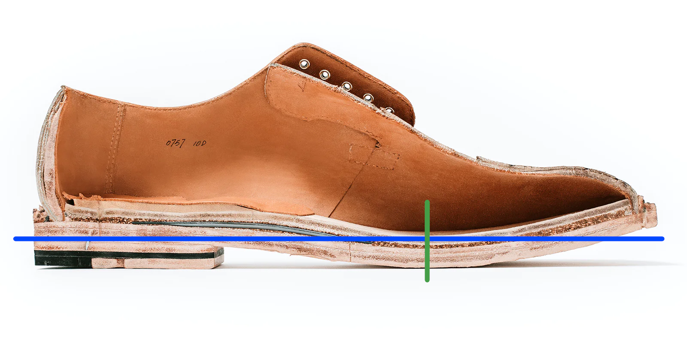
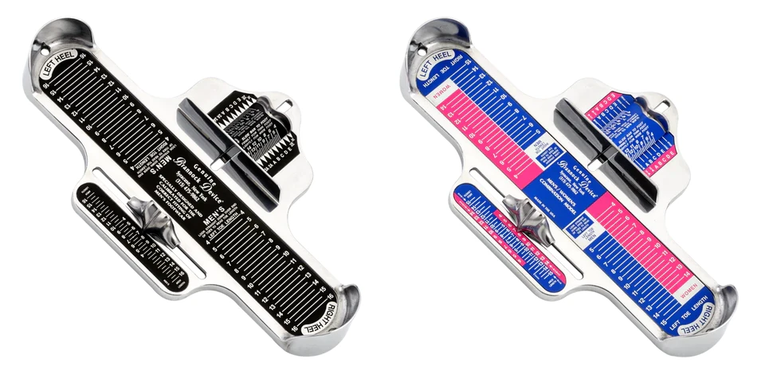

import { Image } from 'astro:assets';
import metatarsal from '../../../assets/metatarsal.png';

## What does proper sizing mean?

In general, the vast majority of people size shoes off of the total length of the shoe and the total length of the foot. With something like a sneaker, you can get away with doing that as the shoe is very flexible, but with more structured footwear like the kind we talk about here, that's not how it works. You want *enough* toe room, of course, but a shoe like this only really wants to flex at one point -- the deepest point of the forefoot. Here's a picture of a cut in half Grant Stone shoe[^1] to help show what I mean by "deepest", marked by the green line:

Your foot, incidentally, also only really wants to flex at one point -- the ball of your foot, which is where the heads of the metatarsal bones are. Here's an illustration of the bones of the (right) foot viewed from above[^2]:

The green line marks the head of the first metatarsal bone. To make the mechanics of it all make sense, we want the green line from the first picture and the green line from the second picture to line up. This will also result in the arch curve of your foot being properly aligned with that of the shoe.

## How do I get my proper size?

The best way we have to get reliable sizing information is by taking pictures of your feet on a [Brannock device](https://brannock.com/collections/products/products/mens-brannock-device). In the US, I recommend buying a Brannock as opposed to finding one in a store for multiple reasons: people feel rushed in a store, many stores have weird shoe sizing devices that are either from other companies, or have the wrong scale, or are just in bad condition, but again, most importantly, a Brannock is $70, which is less than the loss you would make if you had to resell even just a single pair of missized entry level goodyear welted shoes.

This is the part that's a little more expensive outside of the US. Brannock devices are also available on Amazon, but you may have to pay a good bit more for shipping. In my opinion, buying one is still worth it. Even if you pay another $70 for shipping, you're still spending less than you would lose by reselling a single missized pair of boots. 

It's important that you buy either a men's or a combination Brannock device, as shown below. Other devices are not useful for our purposes.

## What does the Brannock device tell me?

The Brannock device gives you three measurements for each foot: the heel to toe length, the heel to ball length, and the width. The heel to toe length is as simple as it sounds -- the US men's size that the  total length of your foot corresponds to. The heel to ball size, however, is where the magic happens. It tells you, effectively, the US men's size that corresponds to the length of your foot from the heel to that green line in the picture from the previous section. Many people, quite possibly a majority of the population, have feet with toes that are short relative to their heel-to-ball length. If those people size off of their total length, they're wearing shoes that are too small. The third measurement -- the width -- tells you how wide your foot is relative to other feet of the same length. By length here, I mean the greater of your heel to ball size and heel to toe size. Of course, these three measurements don't tell you everything. Instep height, toe splay, ankle width, etc. are all things that can influence fit, but Brannock measurements are a great foundation and allow us to provide reliable sizing advice for any last out there. The [instructions page](https://brannock.com/pages/instructions-fitting-tips) on their website provides a good overview of how things work.

{/*
<!-- TODO: Add page for detailed instructions on how to align the sliders and take pictures. -->

<!-- ## How do I use a Brannock device? -->

<!-- ## How do I take pictures of my feet on a Brannock device? -->

<!-- ## How do I use the pictures to get sizing advice? -->

<!-- TODO: Add page that explains what fit means. Look at Ron Ryder podcast episodes. -->

<!-- ## How are well-fitting shoes supposed to feel? -->
*/}

[^1]: https://www.grantstoneshoes.com/pages/make
[^2]: https://commons.wikimedia.org/wiki/File:Gray268.png