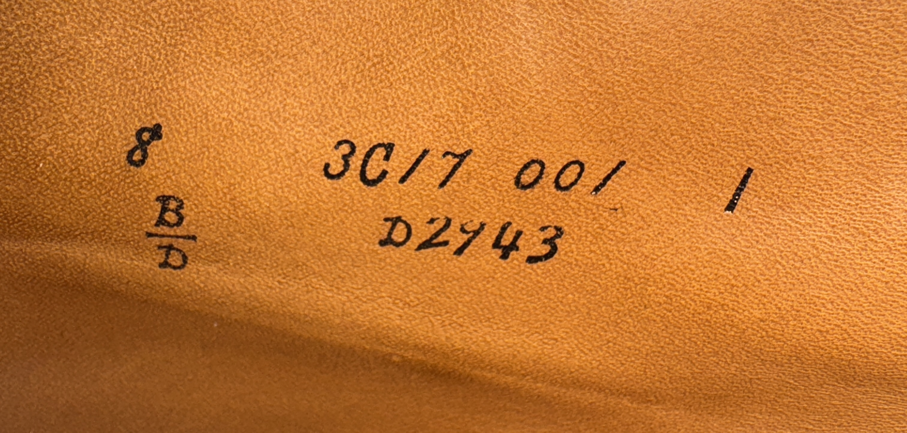
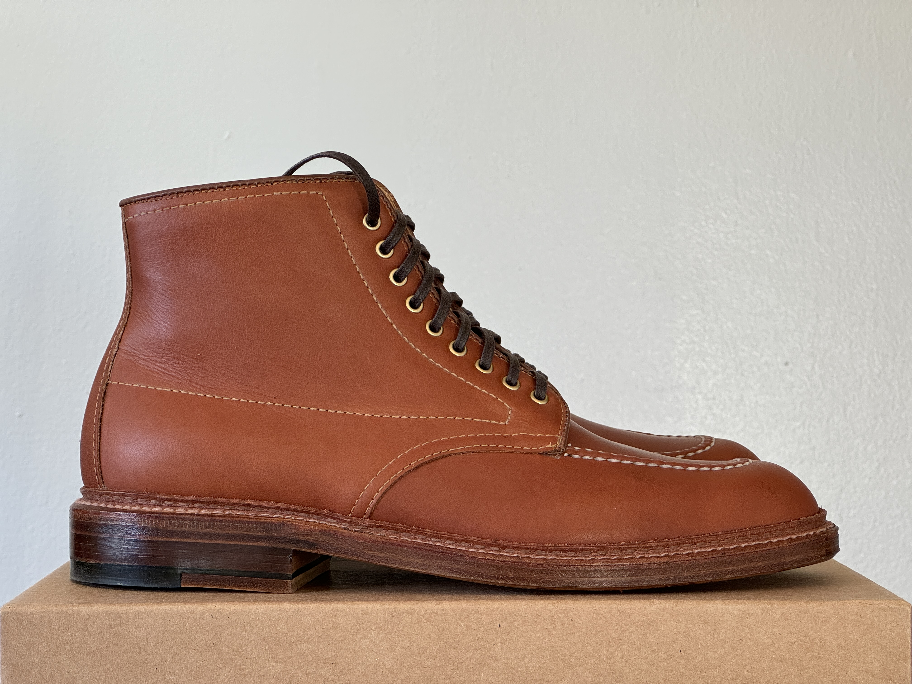

## Lasts

This list does not contain all of Alden's lasts, as some are quite rare or have been discontinued, but going with your Brannock size tends to be a safe choice for most of them. Below are the lasts that are most commonly seen today for which we know enough to offer sizing advice. This list may expand in the future.

### 379X
The 379X last is the closest thing Alden has to a Munson-style last. It has a narrow heel, sculpted arch, and a wide, roomy toebox. People tend to be split between half down from Brannock and true to size, primarily as a function of how much volume their feet have. I recommend trying your Brannock size first if possible.

### Aberdeen
The Aberdeen last is Alden's narrowest last. It has a tapered almond toe and is seen on their dressier loafers, such as the tassel loafer and full strap penny loafer. I recommend going with your Brannock size.

### Barrie
The Barrie last has a round toe and a more generous instep than most of Alden's lasts. It's used on a wide variety of dressy and casual lace-up patterns. I recommend going with your Brannock size, but if you have particularly low volume feet, you might want to go down a half size.

### Copley
The Copley last has an almond toe shape and is most commonly seen on Alden's flex welt penny loafers. I recommend going with your Brannock size.

<!-- ### Grant -->

### Hampton
The Hampton last is one of Alden's narrower lasts, but with a slightly taller toebox than, say, an Aberdeen or a Plaza. It's most commonly seen on oxfords, but boots have also been made on it. I recommend going with your Brannock size.

<!-- ### Leydon -->

### Modified
The Modified last is an anatomical last with a high arch and snug waist. Shoes on Modified feature an extended heel counter, similar to that found on TruBalance shoes. The last has an outward swing, resulting in more room on the lateral side of the foot, and the straight edge on the lateral side makes for a roomy toebox.  Most people will want to go down a half size from their Brannock size.

<!-- ### Orleans -->

### Plaza
The Plaza last has a chisel toe, setting it apart from the rest of Alden's lasts, and a low volume toebox. It's most commonly used for dressier patterns such as oxfords, but can also be seen on some loafers and boots. I recommend going with your Brannock size.

<!-- ### Tremont -->

### TruBalance
The TruBalance last is one of Alden's most popular lasts. It has a wide ball and a narrow heel, and TruBalance shoes have an extended heel counter that runs farther along the side of the shoe than that on most other shoes. It's most commonly used for Indy boots, but a number of other casual patterns are made on it as well. The footbed is relatively flat, so it might not be the best choice for people who need a lot of arch support. Many people find that they need to go down a half size from their Brannock size, and that is my general recommendation for most people, but if you have a taller instep, I recommend trying your Brannock size first if possible.

### Van
The Van last is a high volume round toe last with a raised sidewall, and is most commonly seen on Alden's Leisure Handsewn penny loafers. I recommend going half down from your Brannock size.

<!-- Uncommon Lasts

CDI
Classic

Elle

Kendal

M58
M75
Mitch

Snap
Stroller
Super D
Tom

TruDepth
TruFlare
TruForm
TruLine
TruSquare
TruTred
-->

## Deciphering Shoe Inscriptions

All Alden shoes have an inscription on the medial side of the shoe that contains basic information about the shoe. 

The format is as follows:

Starting from the left, we have the length and width. The width on all Alden lasts is indicated separately for the heel and the ball, because their lasts are combination lasts. Since the difference between the two widths is always 2 (AAA/A, B/D, C/E, etc.), we can essentially ignore the (narrower) heel width and just focus on the ball width.

Moving on to the right, the top line indicates the run number. The first two characters indicate the year and month of production. The number is the final digit of the manufacturing year, and the letter is the month. So, for example, 3B could be February of 2023, 2013, 2003, etc. A small exception here is that the letter I is skipped, so the months are: A=January, B=February, C=March, D=April, E=May, F=June, G=July, H=August, J=September, K=October, L=November, M=December. The following two characters are numbers which indicate the order number that was submitted to the factory (e.g. by a retailer ordering a special makeup). The following three characters are the batch number. The final number on the top line, separated by a space, is the pair number, which matches between the left and right shoe.

The bottom line contains only the model code. Stock models and makeups older than 2013 maintain their existing model codes, which sometimes have some sense to them but oftentimes are inscrutable. Starting with stockist makeups in 2013, Alden introduced a new model code schema which is much more consistent. To the best of my ability to find information on the topic, the schema is defined as follows:

\<R\>\<1\>\<2\>\<34\>\<XX\>

\<R\> is a letter indicating the region that the makeup is sold in. 
  - A = Asia with the exception of Japan
  - D = USA
  - G = Canada
  - M = Europe
  - N = Japan

\<1\> is a number indicating the last digit of the year in which the makeup was first introduced.

\<2\> is a number indicating the category of shoe.
  - 1 = tassel loafers and slip-ons
  - 2 = all other loafers
  - 3 = all oxfords
  - 4 = plain toe derbies
  - 5 = cap toe and wingtip derbies
  - 6 = moc toe, apron toe, norwegian split toe, and algonquin toe derbies
  - 7 = two-eyelet chukka boots and george boots
  - 8 = plain toe, cap toe, and wingtip boots
  - 9 = moc toe, apron toe, norwegian split toe, and algonquin toe boots

\<34\> is the number of that particular makeup of that year and [1][2] category, incrementing by one in chronological order.

\<XX\> is a zero to two letter code that indicates certain features of the makeup. The following codes are known as of early 2024:
  - C = Alden commando half sole
  - D = Dainite sole
  - F = flex welt
  - H = speed hooks
  - L = Leisure 3 sole
  - S = lug sole
  - U = unlined
  - Y = wider welt

A few other feature markers are known to have been used on model codes before 2013:
  - E = exposed eyelets
  - M = Eduard Meier makeups (a German retailer)
  - R = thin rubber sole

So, putting it all together, we can get the following information from the picture above:
 - The length is 8, the ball width is D, and the heel width is B.
 - The shoe was produced in March of 2023, 2013, or 2003.
 - The order number is 17.
 - The batch number is 001, meaning that this is the first time this makeup has been produced.
 - The pair number is 1, meaning that this is the first pair of 8 B/D shoes produced in this batch.
 - The model code is D2943, which means:
   - The shoe is sold in the USA
   - The shoe was first introduced in 2022, since all prior years ending in 2 precede 2013 when the new model code schema was introduced. (This also tells us that the shoe was produced in 2023, narrowing down the options above.)
   - The shoe is a moc toe, apron toe, norwegian split toe, or algonquin toe boot.
   - This is the 43rd American moc toe, apron toe, norwegian split toe, or algonquin toe boot makeup introduced in 2022.

Putting it all together, and matching it up against the actual makeup, we find that this is a pair of Indy boots, with all eyelets, on a double leather sole, with a handstitched apron toe, in papaya pegasus calf. This is a stockist makeup from LaRossa Shoe in Massachusetts.

