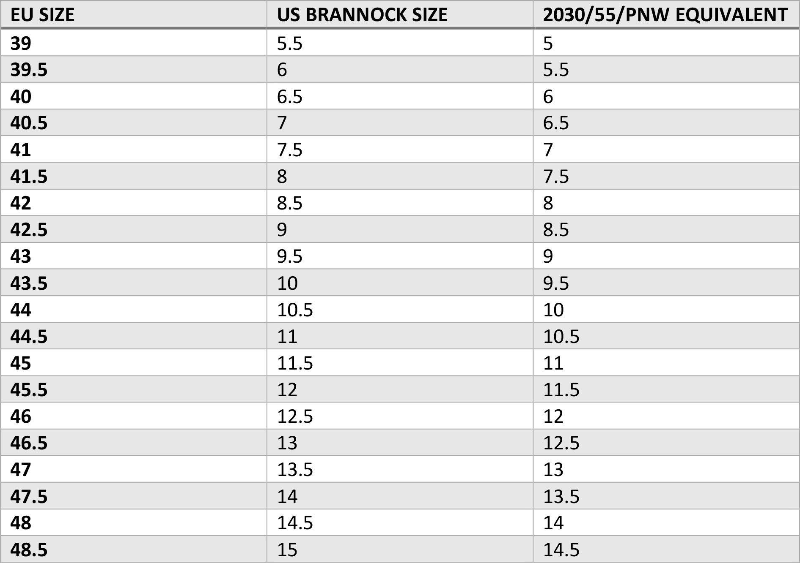

## Moe
The Moe is a relatively sleek last with an almond toe and a slight outward swing. It has a narrower heel and waist, and opens up to a wider forefoot. We recommend following the table below to convert from your Brannock size to your Moe size. Generally, you'll want to go a half size up from the standard EU size used by most makers. I.e. if you are an 8D on the Brannock, you'll want to go with a 41.5 on the Moe last. The Moe last is also used for the Østmo x Iron Boots collaboration, and is available in two widths: D-E and E-EE.

## Asbjørnsen
The Asbjørnsen is a more voluminous last than the Moe, with a noticeable increase in room on the medial side. It also has a rounder toe, and more pronounced arch support. We recommend following the table below to convert from your Brannock size to your Asbjørnsen size. Generally, you'll want to go a half size up from the standard EU size used by most makers. I.e. if you are a 10.5D on the Brannock, you'll want to go with a 44 on the Asbjørnsen last.

For more information, please see Østmo's website, where you can find examples of the patterns available, as well as pictures of the lasts themselves: [https://www.ostmoboots.com/](https://www.ostmoboots.com/).
